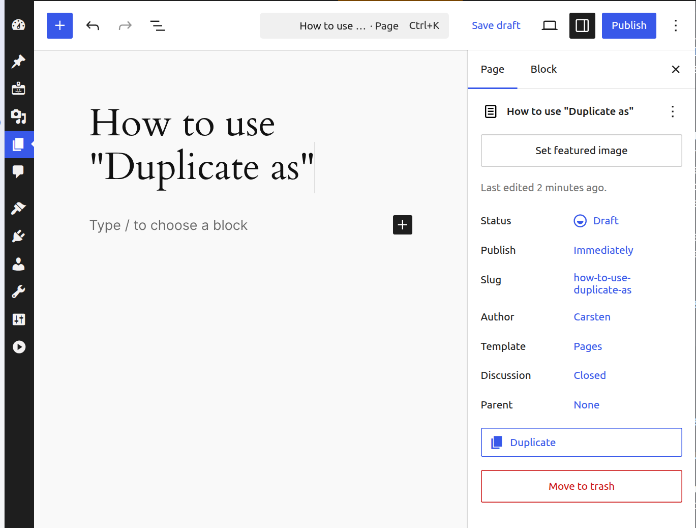
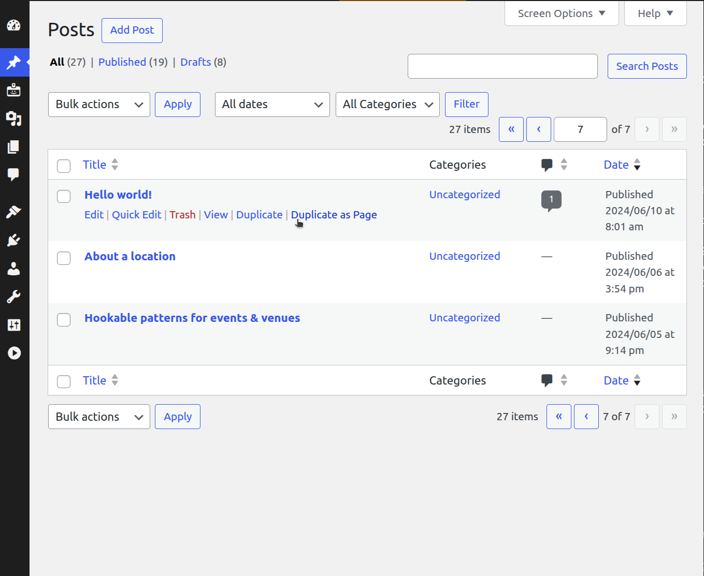

# Duplicate as

**Contributors:** carstenbach & WordPress Telex  
**Tags:** duplicate, post, page, editor, block-editor  
**Tested up to:** 6.8  
**Stable tag:** 0.1.0  
**License:** GPLv2 or later  
**License URI:** https://www.gnu.org/licenses/gpl-2.0.html  

[](https://playground.wordpress.net/?blueprint-url=https://raw.githubusercontent.com/carstingaxion/duplicate-as/main/.wordpress-org/blueprints/blueprint.json) [](https://github.com/carstingaxion/duplicate-as/actions/workflows/build-test-measure.yml)

---

## Description

Duplicate or *Duplicate as* different post type, directly from the Editor Sidebar or the Admin List Tables.

### How It Works

1. Open any post or page in the block editor  
2. Open the Editor Sidebar  
3. Click **Duplicate** or **Duplicate as (...)** to create a copy  
4. The plugin will copy all content and metadata  
5. You’ll be automatically redirected to edit the new draft  

The plugin works with posts and pages by default and can be extended to support custom post types through the post type supports system.


#### Example 1: Duplicate pages *(supported by default)*

```php
add_post_type_support( 'page', 'duplicate_as' );
```

|  |   |
| --- | --- |

#### Example 2: Duplicate and "Duplicate as" for posts *(supported by default)*

```php
add_post_type_support( 'post', 'duplicate_as', array('page', 'post') );
```

|  |   |
| --- | --- |


---

## Frequently Asked Questions

### Where is the duplicate button?

Duplicate or *Duplicate as* different post type, directly from the Editor Sidebar or the Admin List Tables

### Who can see and use the duplicate button?

Only users with the appropriate post editing capabilities can see and use the duplicate button. This typically includes Editors, Administrators, and Authors.

### What content gets duplicated?

The plugin duplicates:

- Post/Page title  
- Post/Page content and all blocks  
- Featured image  
- Categories  
- Tags  
- Custom fields (except internal WordPress fields like edit locks)  
- Post format  
- Comment and ping status  
- Menu order  

### What happens after I click duplicate?

The plugin creates a new draft copy of your post/page and automatically redirects you to edit it. The new post will have the same title as the original.

### Can I duplicate custom post types?

Yes. To enable duplication for custom post types, add post type support:

```php
add_post_type_support( 'your_post_type', 'duplicate_as' );
```

### Can I transform posts to different post types?

Yes. Add post type support with a target post type:

```php
add_post_type_support( 'page', 'duplicate_as', 'post' );
```

This will change the button label to Transform and create the duplicate as the target post type.

### Does it work with page builders?

Yes. Since it duplicates the raw content and all blocks, it works with any block-based page builder or the standard WordPress block editor.

### Can I customize what gets duplicated?

Yes. The plugin provides several filter hooks:

- `duplicate_as_post_data` – Filter post data
- `duplicate_as_taxonomies` – Filter taxonomies to copy
- `duplicate_as_taxonomy_terms` – Filter terms for a specific taxonomy
- `duplicate_as_excluded_meta_keys` – Filter excluded meta keys
- `duplicate_as_meta_value` – Filter individual meta values
- `duplicate_as_featured_image` – Filter featured image ID

---

## Screenshots

1. The duplicate option appears in the More Actions menu (⋮) in the editor header
2. Processing state shows while the post is being duplicated
3. Success redirect to the newly created draft

---

## Installation

1. Upload the plugin files to the `/wp-content/plugins/duplicate-as` directory, ~~or install the plugin through the WordPress Plugins screen~~  
2. Activate the plugin through the **Plugins** screen in WordPress  
3. Open any post or page in the block editor  
4. Click the More Actions menu (⋮) to see the duplicate option  

---

## Changelog

### 0.1.0

Initial release

- Works on every post type, because its build based on post type supports
- Duplicate posts and pages instantly from the Editor Sidebar or the Admin List Tables
- Complete duplication post-data, taxonomy terms and postmeta-data (incl. featured image)
- Can transform posts to different post types when configured  
- New duplicates are created as drafts
- Loading states and graceful error messages if something goes wrong  
- Only visible to users with appropriate capabilities  
- Proper ARIA labels and WordPress admin integration  
- Multiple filter and action hooks for customization


---

# Developer Notes

Take a look at the short [Developer Documentation](docs/developer/README.md) and the [list of filter & action hooks](docs/developer/hooks/Hooks.md).
